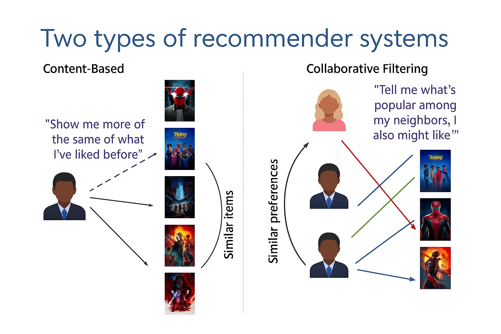
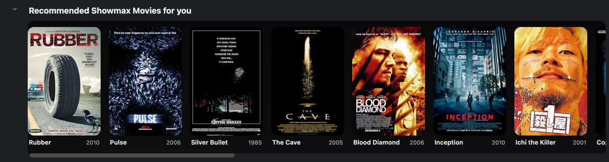

# Showmax Streaming Service Movie Recommendation System.
## Applying Content-Based filtering and Matrix-Algebra to build a Movie Recommendation System with Pandas.

### Definition of Recommender Systems:
Recommender systems are algorithms that learn from user and item data to suggest what to watch, buy or apply for. You see them everywhere, Uber Eats app shelves, prime video streaming catalogues and Linkedin job boards. In this notebook we focus on content-based recommendations: represent items by their attributes, learn a user profile from past choices and rank new items accordingly. We’ll build a clear, lightweight model in Python with pandas.

**Content Based Recommender Systems:**
A Content-based recommender system tries to recommend items to users, based on their profile. 
The user’s profile revolves around the user’s preferences and tastes, or based on the user ratings.

### Dependencies:
To follow along with this project, it's ideal to have the following library imported into a notebook in an IDE.
I used the Pycharm IDE for this project, but any IDE would suffice. 
All we need is Pandas and a good knowledge of matrix-Algebra, for display of recommended content, we use HTML and lastly Request for movie posters api call.

* `import pandas as pd`
* `import html`
* `import requests, io`

### Project Structure:

1. **Data Acquisition:**
We shall use a public data set for movie ratings from [Grouplens.org](https://grouplens.org/datasets/movielens/).
The `ratings.csv`and `movies.csv` data sets are available for your use in the root directory of this repo.

2. **Data Cleaning and Pre-processing:**
A summary of the tasks in this phase include:-
* Fixing missing values. 
* Assigning proper headers. 
* Removing irrelevant features. 
* Applying descriptive Statistical moments.
* One-Hot-Encoding categorical features and confirming proper data types.

3. **Content Based System:**
Tasks here include:-
* Creating User Profiles. 
* Extracting User's Preferences. 
* Learning the User Profile via Matrix-Algebra. 
* Building Recommendations.
* Deploying the Recommender System.

### Summary:
#### Pros and Cons of Content-Based Recommender Systems.

**Pros:**
* Learns user’s preferences
* Highly personalized for the user

**Cons:**
* Doesn’t take into account what others think of the item, so low-quality item recommendations might happen
* Extracting data is not always intuitive
* Determining what characteristics of the item the user dislikes or likes is not always obvious
* No new genre of movies will ever get recommended to the user, except the user rates or indicates his/her preference for that genre.

A better solution is a **Hybrid-Recommender-System** that combines both Content-Based-Filtering and Collaborative-Filtering to proffer personalised as well as generally popular and preferred movies by Users who are similar to the User.

### OMDB API call and Rendering

